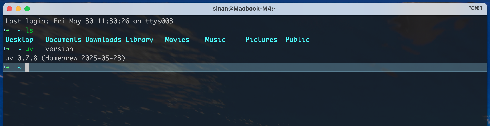

# How to set up a new MacBook

#### Download [iTerm2](https://iterm2.com)

#### Install Xcode command line tool

`xcode-select --install`

#### Install `oh-my-zsh`

`sh -c "$(curl -fsSL https://raw.github.com/ohmyzsh/ohmyzsh/master/tools/install.sh)"`

Userful plugins for zsh:
```
git clone https://github.com/zsh-users/zsh-autosuggestions.git ${ZSH_CUSTOM:-~/.oh-my-zsh/custom}/plugins/zsh-autosuggestions

git clone https://github.com/zsh-users/zsh-syntax-highlighting.git ${ZSH_CUSTOM:-~/.oh-my-zsh/custom}/plugins/zsh-syntax-highlighting
```

Then add the plugins to `~/.zshrc`

`plugins=(git zsh-syntax-highlighting zsh-autosuggestions)`

#### Install Homebrew

`/bin/bash -c "$(curl -fsSL https://raw.githubusercontent.com/Homebrew/install/HEAD/install.sh)"`

Follow the "Next steps" on the screen after installation completes to add the brew command to PATH.

#### Install Sublime Text editor

`brew install sublime-text`

Then you can open files using

`subl ~/.zshrc`

#### Make iTerm2 prettier 

I'm tired of setting up new profiles so I just keep reusing my [current profile setting for iTerm2](./iterm_default_profile.json) as the default starting point. You can import the profile via:

`Settings > Profiles > Other Actions... > Import JSON Profiles...`

It might still require a few tweaks here and there, but it shouldn't take long.


Customize the hostname shown on top of the terminal window, e.g.

`scutil --set HostName "Macbook-M4"`

After restarting the terminal, it'll look like this:



#### A few software that make life easier

```
brew install git
brew install wget
brew install tree
brew install google-chrome
```

#### Set up `git` locally

Follow the official guide to [generate a new SSH key and adding it to the ssh-agent](https://docs.github.com/en/authentication/connecting-to-github-with-ssh/generating-a-new-ssh-key-and-adding-it-to-the-ssh-agent), then [add a new SSH key to your GitHub account](https://docs.github.com/en/authentication/connecting-to-github-with-ssh/adding-a-new-ssh-key-to-your-github-account).


Then update the default identity in git config:

```bash
git config --global user.email "you@example.com"
git config --global user.name "Your Name"
```


I like to set up aliases for comman git commands to save time typing: 

```
git config --global alias.co checkout
git config --global alias.st status
git config --global alias.ci commit
git config --global alias.br branch
```
Then later you can jsut run `g br --all` or `g ci -m "commit message"` (the `g` alias is set by oh-my-zsh).

